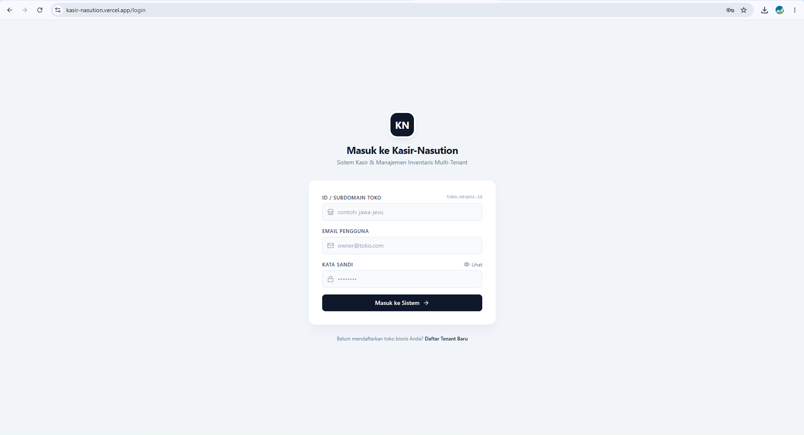
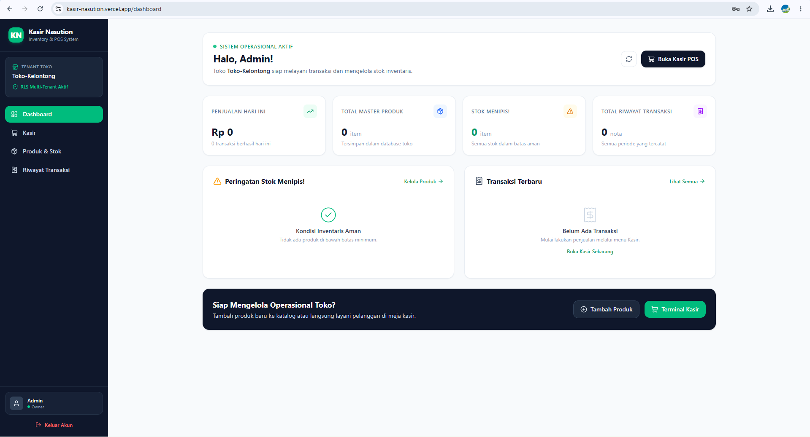
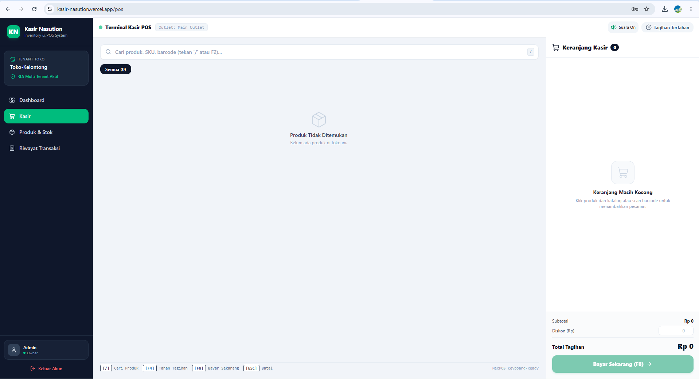
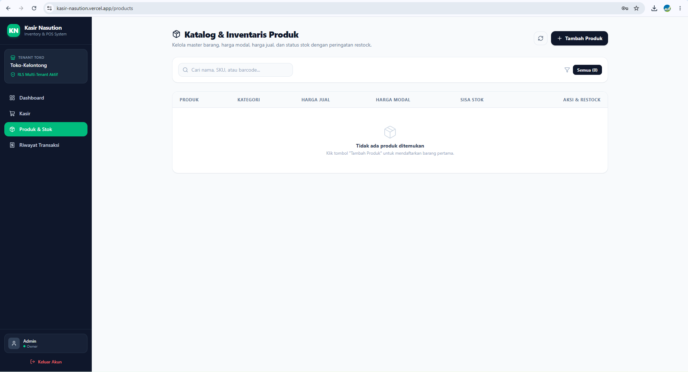
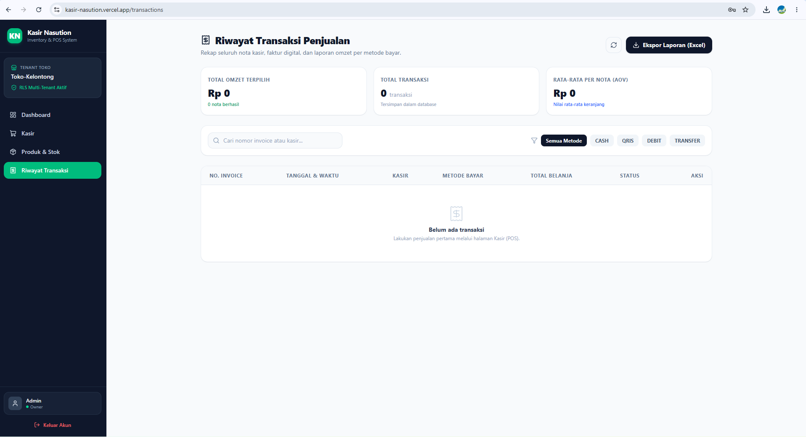

   # Kasir Nasution - Inventory & POS System

Aplikasi kasir (Point of Sale) dan manajemen stok barang berbasis web dengan arsitektur full-stack. Sudah mendukung fitur multi-tenant untuk pemisahan data antar toko.

## Live Link
Aplikasi bisa diakses di: https://vercel.app

## Preview Aplikasi

  
Klik untuk melihat Screenshot Website

   ### Halaman Login
  
  
  ### Dashboard Utama
  

  ### Terminal Kasir / POS
  

  ### Manajemen Produk & Stok
  

  ### Riwayat Transaksi
  

### Akun Demo
Gunakan akun ini untuk mencoba fitur dashboard dan transaksi tanpa register baru:

- Id: toko-kelontong
- Email: admin@gmail.com
- Password: admin123

## Tech Stack
- Frontend: React.js, Vite, TypeScript, Tailwind CSS (Hosted on Vercel)
- Backend: Node.js, Express, TypeScript (Hosted on Railway)
- Database: PostgreSQL (Hosted on Neon.tech) dengan Prisma ORM

## Fitur Utama
- Dashboard: Grafik penjualan harian, counter produk, alert stok menipis, dan riwayat transaksi terbaru.
- Terminal POS: Halaman transaksi kasir dengan kalkulasi otomatis.
- Manajemen Stok: Operasi CRUD produk lengkap dengan pengaturan limit minimum stok.
- Multi-Tenant: Pemisahan data operasional per toko (misalnya Toko Manabusi).
- Autentikasi: Login menggunakan JWT (JSON Web Token) dan Refresh Token.

## Cara Menjalankan di Lokal

1. Clone repositori frontend dan backend.
2. Buat file .env di folder backend dan lengkapi variabel berikut:
   DATABASE_URL=
   JWT_SECRET=
   JWT_REFRESH_SECRET=
3. Jalankan "npm install" di folder frontend dan backend.
4. Lakukan sinkronisasi database dengan perintah "npx prisma generate" dan "npx prisma db push".
5. Jalankan "npm run dev" pada masing-masing terminal.
